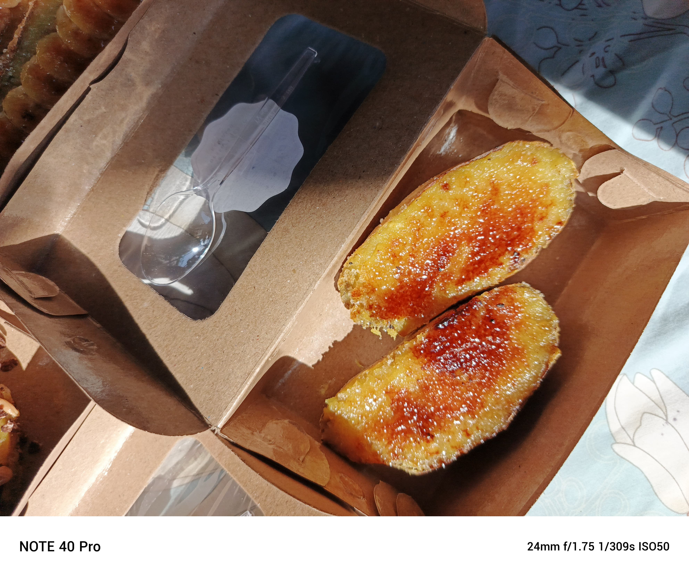
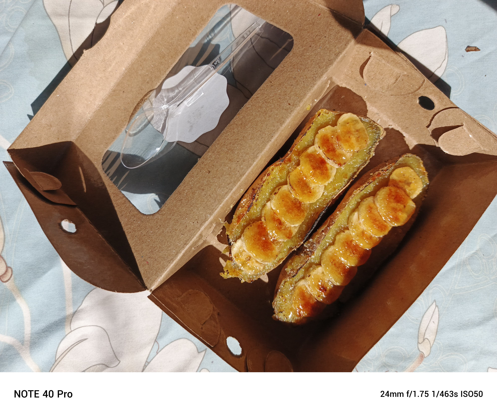
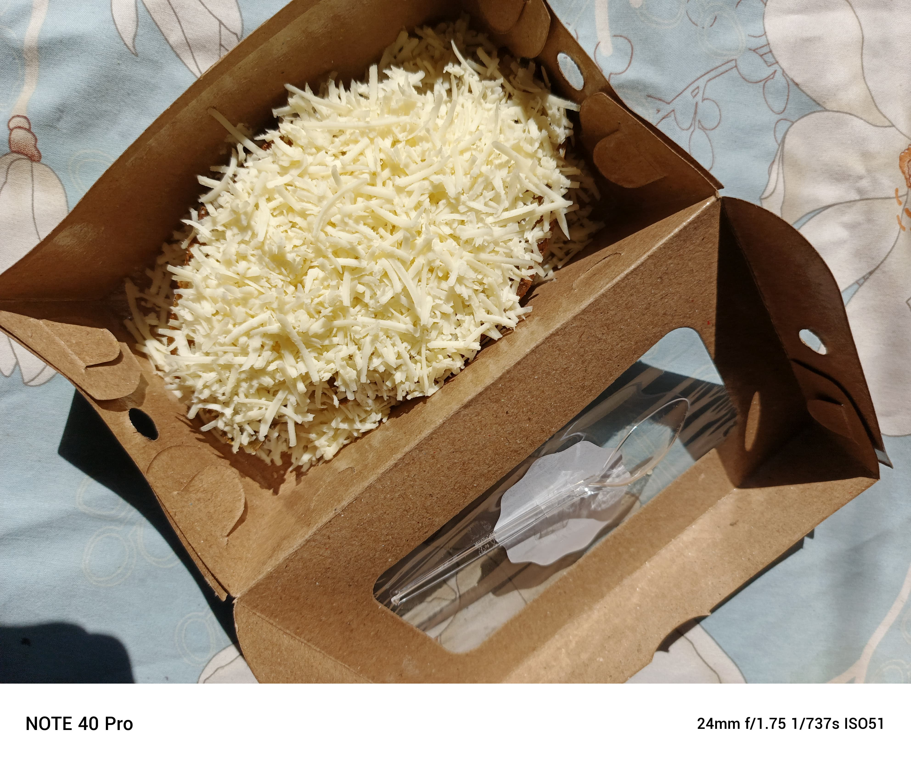
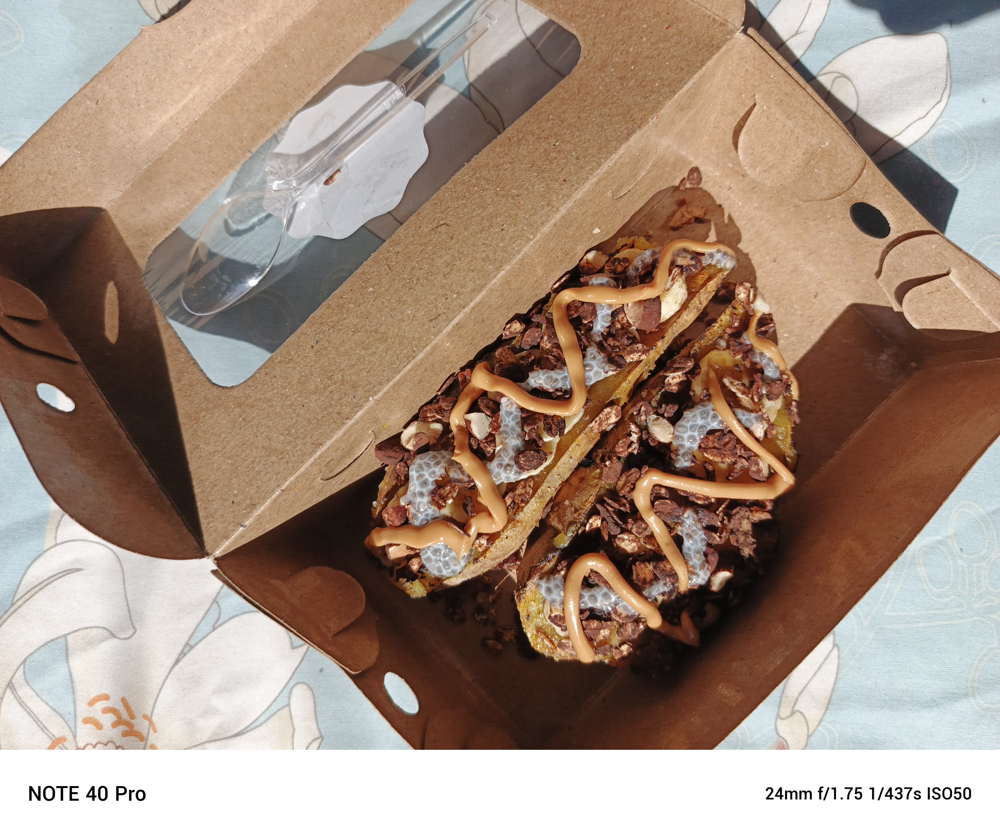
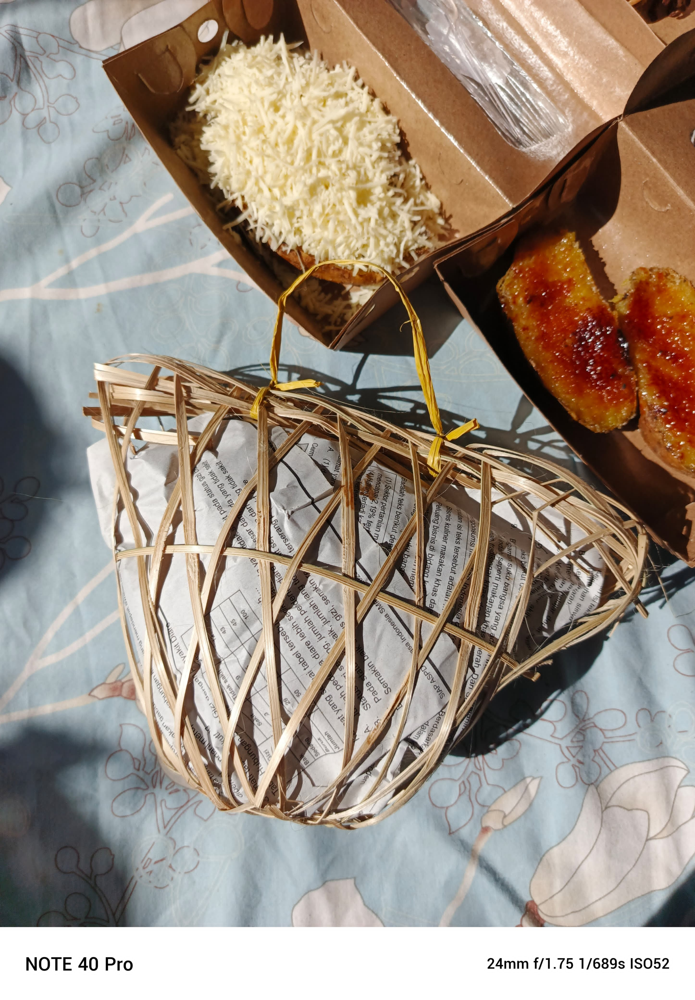
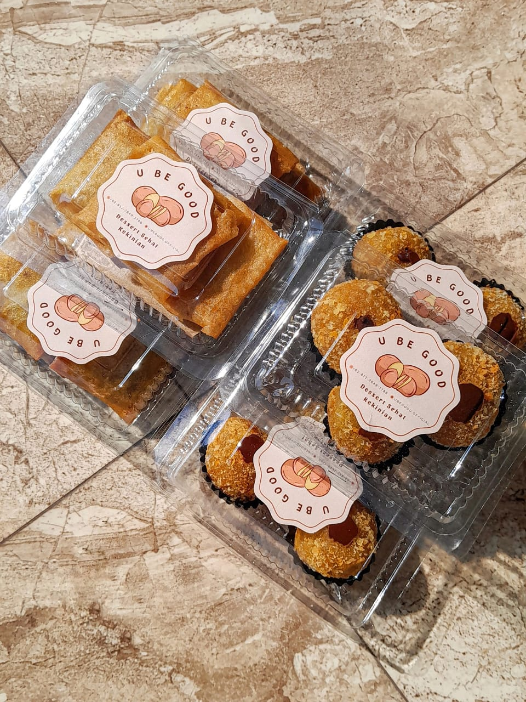
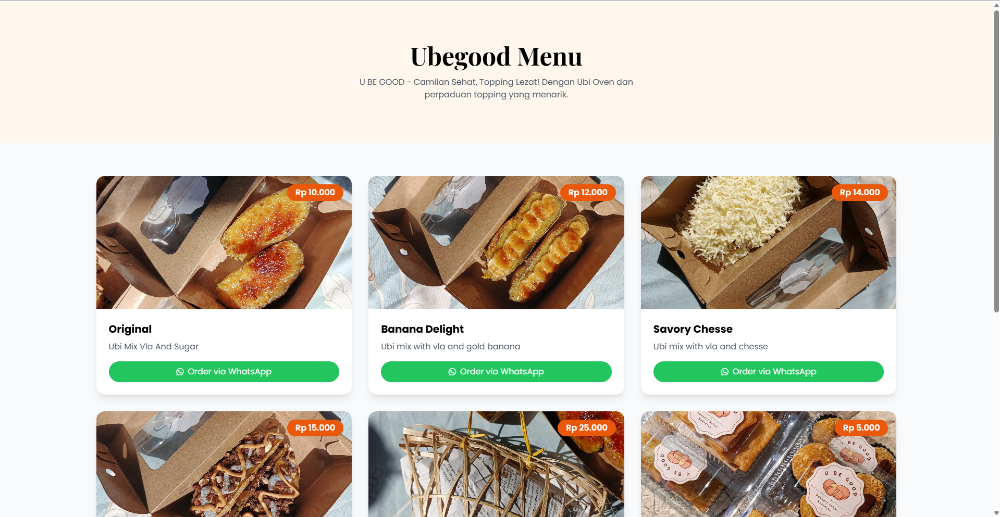
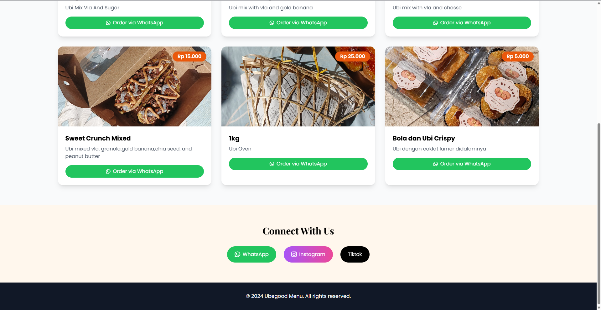

<div align="center">


# 🍠 Ubegood

### Ubi Oven Premium dengan Topping Lezat & Tampilan Modern


<br>


</div>

---
<p align="center">
  <a href="https://ubegood.netlify.app/" target="_blank">
    
  </a>
</p>

---
## ✨ Overview

**Ubegood** adalah website landing page modern yang dirancang untuk mempromosikan produk **Ubi Oven Premium** dengan berbagai pilihan topping lezat.

Website ini dibuat dengan pendekatan modern menggunakan **Tailwind CSS**, **AOS Animation**, dan **PHP**, sehingga mampu memberikan pengalaman pengguna yang menarik, responsif, dan mudah digunakan.

Fokus utama pengembangan website ini adalah:

* 🎨 Visual yang menarik dan modern
* 📱 Responsive di berbagai perangkat
* ⚡ Performa ringan dan cepat
* ✨ Animasi interaktif yang halus
* 🛒 Pengalaman pemesanan yang mudah

---

# 🎓 MBKM Entrepreneurship Project

**Ubegood** merupakan salah satu proyek yang dikembangkan dalam program **Merdeka Belajar Kampus Merdeka (MBKM) Kewirausahaan**.

Proyek ini bertujuan untuk mengembangkan usaha berbasis produk pangan lokal melalui pemanfaatan teknologi digital sebagai media promosi dan pemasaran.

Melalui program MBKM Kewirausahaan, pengembangan proyek ini mencakup:

* 💡 Identifikasi peluang bisnis
* 📊 Analisis pasar dan target pelanggan
* 🎨 Perancangan branding produk
* 💻 Pengembangan website promosi
* 📱 Implementasi UI/UX modern
* 📈 Strategi pemasaran digital

Website ini menjadi bagian dari upaya digitalisasi usaha dan pengembangan produk lokal agar mampu menjangkau pasar yang lebih luas.

---

# 🖼️ Hero Preview

<p align="center">
  
</p>

---

# 🌟 Featured Products

<table>
<tr>
<td align="center">
<br>
<b>🍌 Banana Delight</b>
</td>

<td align="center">
<br>
<b>🧀 Savory Cheese</b>
</td>

<td align="center">
<br>
<b>🍫 Sweet Crunch</b>
</td>
</tr>
</table>

<br>

<table>
<tr>
<td align="center">
<br>
<b>🍠 Ubi Oven 1 KG</b>
</td>

<td align="center">
<br>
<b>🥔 Bola Ubi Crispy</b>
</td>
</tr>
</table>

---

# 🚀 Features

## 🎨 Modern User Interface

* Clean & modern layout
* Premium food branding
* Elegant typography
* Attractive visual hierarchy

## ✨ Interactive Animation

* Scroll reveal animation
* Fade-up effects
* Hover interactions
* Smooth transition effects

## 📱 Responsive Design

* Mobile-first approach
* Tablet optimized
* Desktop friendly
* Flexible grid system

## 🛒 Easy Ordering Experience

* WhatsApp integration
* Clear call-to-action buttons
* Easy navigation flow
* Product-focused design

---

# 🛠️ Tech Stack

<div align="center">


</div>

### Frontend

* Tailwind CSS
* Font Awesome
* AOS (Animate On Scroll)

### Backend

* PHP

### Design Principles

* Responsive Design
* User Experience (UX)
* Modern UI Design
* Accessibility Consideration

---

# 📂 Project Structure

```text
Ubegood/
│
├── index.php
│
├── p1.jpg
├── p2.jpg
├── p3.jpg
├── p5.jpg
├── p6.jpg
├── p9.jpg
│
└── README.md
```

---

# ⚡ Getting Started

Clone repository:

```bash
git clone https://github.com/yourusername/ubegood.git
```

Masuk ke folder project:

```bash
cd ubegood
```

Jalankan PHP Built-in Server:

```bash
php -S localhost:8000
```

Buka browser:

```text
http://localhost:8000
```

---

# 🎨 Customization

<details>
<summary><b>Click to Expand</b></summary>

### Mengubah Produk

Edit data produk pada:

```php
index.php
```

### Mengubah Warna Utama

Cari class Tailwind berikut:

```html
bg-orange-600
```

Kemudian sesuaikan dengan warna branding yang diinginkan.

### Mengubah Efek Animasi

Cari konfigurasi:

```javascript
AOS.init()
```

Parameter yang dapat disesuaikan:

* duration
* delay
* easing
* offset

</details>

---

# 📸 Responsive Preview

| Desktop         | Mobile            |
| --------------- | ----------------- |
| ✅ Optimized     | ✅ Optimized       |
| Hero Banner     | Responsive Layout |
| Product Grid    | Stacked Cards     |
| Hover Animation | Touch Friendly    |

---

# 🎯 Project Goals

* Meningkatkan branding produk Ubegood
* Menampilkan informasi produk secara menarik
* Mendukung pemasaran digital UMKM
* Meningkatkan pengalaman pengguna
* Memanfaatkan teknologi web modern dalam promosi produk

---

# 🏆 Project Achievement

* 🎓 Developed as part of MBKM Entrepreneurship Program
* 💡 Applied entrepreneurship concepts into digital products
* 🍠 Promoted local food products through digital platforms
* 🌐 Built responsive web-based promotional media
* 📱 Implemented modern UI/UX principles
* 📈 Supported digital marketing activities

---

# ⭐ Why Ubegood?

* 🍠 Healthy & Delicious Product
* 🎨 Modern Interface
* ⚡ Lightweight Performance
* 📱 Fully Responsive
* ✨ Smooth User Experience
* 🚀 Easy Product Promotion

---

## 👨‍💻 Author

**Mil**

Information Systems Graduate | UI/UX Designer | Front-End Enthusiast

---

<div align="center">

## 💛 Made with Passion During MBKM Entrepreneurship Program

If you like this project, don't forget to ⭐ the repository.

---

## 🖼️ Website Screenshots

Berikut adalah tampilan antarmuka website **U Be Good**, sebuah platform yang dirancang untuk memberikan pengalaman pengguna yang modern, informatif, dan mudah digunakan. Desain website difokuskan pada penyampaian informasi yang jelas, navigasi yang intuitif, serta tampilan visual yang menarik untuk meningkatkan engagement pengguna.


<p align="center">
  
</p>

<p align="center">
  
</p>


</div>
